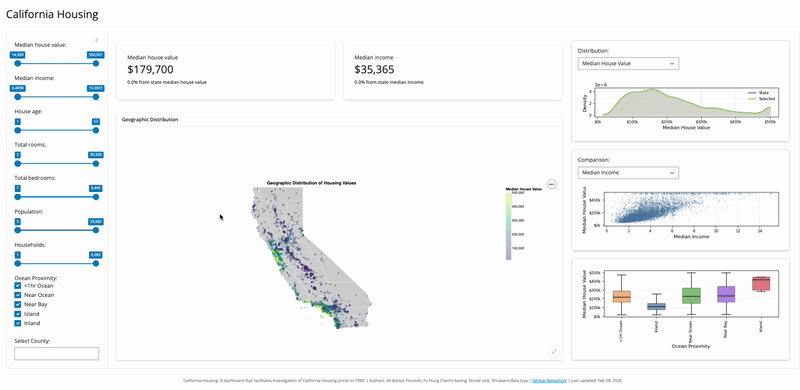

# California Housing Dashboard

An interactive dashboard for exploring the geographic and socioeconomic drivers of housing prices in California (1990).



**Live dashboard**
https://019f90ae-c8d7-5539-4d94-38f87f021945.share.connect.posit.cloud/


## Why this dashboard exists (for users)

Housing prices vary dramatically across California due to geography, income levels, housing characteristics, and proximity to amenities such as the ocean. This dashboard enables **user-driven exploration** of these relationships using California housing data from 1990.

It is designed to help users:
- visually investigate spatial patterns in house prices
- understand how socioeconomic and structural factors relate to price variation
- identify clusters of high- and low-value regions without writing code

The project also serves as a **proof of concept** for building extensible housing dashboards that could be adapted to more recent or broader datasets.

---

## What you can do with it

- Explore an **interactive map** of median house values by location
- Investigate relationships between house price and:
  - median household income
  - housing age
  - proximity to the ocean
- Compare housing characteristics using scatter plots and bar charts

---

## Run locally (for contributors)

### Requirements
- Conda
- Python (managed via `environment.yml`)
- Posit Shiny for Python

### Clone the repository

Using HTTPS:
```bash
git clone https://github.com/UBC-MDS/DSCI-532_2026_5_california_housing.git
```

Or using SSH:
```bash
git clone git@github.com:UBC-MDS/DSCI-532_2026_5_california_housing.git
```

Navigate to the project root:
```bash
cd DSCI-532_2026_5_california_housing
```
Create the environment

```bash
conda env create -f environment.yml
conda activate dsci-532-dashboard
```

Launch the dashboard

```bash
shiny run --reload src/app.py
```

Open http://127.0.0.1:8000 in your browser.

## Testing

Run all tests (unit + E2E) with:

```bash
conda activate dsci-532-dashboard  
playwright install                 # one-time: download browser binaries
pytest --base-url http://127.0.0.1:8765
```

- **Unit tests** (`tests/test_utils.py`): pytest tests for filtering and aggregation logic.
- **E2E tests** (`tests/test_e2e.py`): Playwright tests; they start the Shiny app automatically. The AI Chatbot tab requires `GITHUB_TOKEN` in `.env` for the app to start; if missing, E2E tests may be skipped.

See [TESTING.md](TESTING.md) for test coverage and reflection.

## Contributing

Contributions, issues, and suggestions are welcome.

Please read [CONTRIBUTING.md](CONTRIBUTING.md) before opening an issue or submitting a pull request.

## Authors

- Ali Boloor Foroosh
- Fu Hung (Teem) Kwong
- Nicole Link
- Shrabanti Bala Joya

## Attribution

Generative AI tools (Google Gemini, OpenAI ChatGPT, and GitHub Copilot) were used to assist with code debugging. All generated content was reviewed and edited by the authors to ensure accuracy and quality.

