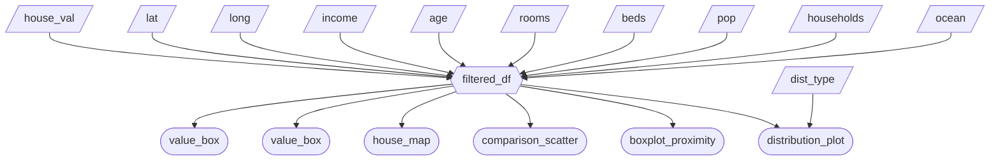

# Milestone 2 App Specification

## Section 1: Job Stories
| #   | Job Story                       | Status         | Notes                         |
| --- | ------------------------------- | -------------- | ----------------------------- |
| 1   | I want to analyze the relationship between median income and median house value so I can determine whether higher income areas were associated with higher property prices in 1990. | ⏳ Pending |                               |
| 2   | I want to compare median house values across ocean proximity categories in order to assess whether coastal access was associated with higher property values in 1990. | ⏳ Pending     |       |
| 3   | I want to visualize the geographic distribution of house values across California to identify spatial clusters of high and low value regions.| ⏳ Pending  |                               |


## Section 2: Component Inventory
| ID            | Type          | Shiny widget / renderer   | Depends on                   | Job story  |
| ------------- | ------------- | -----------------------   | ---------------------------- | ---------- |
| `house_val`   | Input         | `ui.house_val()`          | —                            | #1, #2, #3     |
| `lat`         | Input         | `ui.lat()`                | —                            | #1, #2, #3     |
| `long`        | Input         | `ui.long()`               | —                            | #1, #2, #3     |
| `income`      | Input         | `ui.income()`             | —                            | #1, #2, #3     |
| `age`         | Input         | `ui.age()`                | —                            | #1, #2, #3     |
| `rooms`       | Input         | `ui.rooms()`              | —                            | #1, #2, #3     |
| `beds`        | Input         | `ui.beds()`               | —                            | #1, #2, #3     |
| `pop`         | Input         | `ui.pop()`                | —                            | #1, #2, #3     |
| `households`  | Input         | `ui.households()`         | —                            | #1, #2, #3     |
| `ocean`       | Input         | `ui.ocean()`              | —                            | #1, #2, #3     |
| `dist_type`   | Input         | `ui.dist_type()`          | —                            | #1, #2         |
| `filtered_df` | Reactive calc | `@reactive.calc`        | `house_val`,`lat`,`long`,`income`,`age`,`rooms`,`beds`,`pop`,`households`,`ocean`,`dist_type` | #1, #2, #3 |
| `median_house`        | Output        | `ui.value_box`          | `filtered_df`                | #1, #2         |
| `median_income`       | Output        | `ui.value_box`          | `filtered_df`                | #1, #2         |
| `house_map`           | Output        | `@render.plot`          | `filtered_df`                | #3             |
| `distribution_plot`   | Output        | `@render.plot`          | `filtered_df`,`dist_type`    | #1, #2         |
| `comparison_scatter`  | Output        | `@render.plot`          | `filtered_df`                | #1, #2         |
| `boxplot_proximity`   | Output        | `@render.plot`          | `filtered_df`                | #1, #2         |


## Section 3: Reactivity Diagram
````markdown

````


## Section 4: Calculation Details