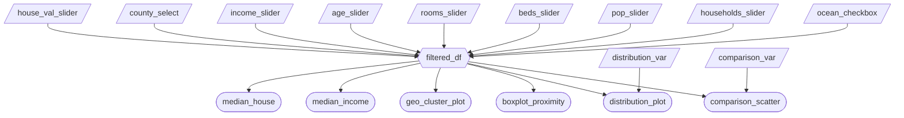

# Milestone 2 App Specification

## Section 1: Job Stories
| #   | Job Story                       | Status         | Notes                         |
| --- | ------------------------------- | -------------- | ----------------------------- |
| 1   | I want to analyze the relationship between median income and median house value so I can determine whether higher income areas were associated with higher property prices in 1990. | ✅ Implemented |  with scatterplot comparing income and house value   |
| 2   | I want to compare median house values across ocean proximity categories in order to assess whether coastal access was associated with higher property values in 1990. | ✅ Implemented     |  with ocean proximity boxplot  |
| 3   | I want to visualize the geographic distribution of house values across California to identify spatial clusters of high and low value regions.| ✅ Implemented  |  with map visualization  |


## Section 2: Component Inventory
| ID            | Type          | Shiny widget / renderer   | Depends on                   | Job story  |
| ------------- | ------------- | -----------------------   | ---------------------------- | ---------- |
| `house_val_slider`   | Input         | `ui.input_slider()`          | —                            | #1, #2, #3     |
| `county_select`      | Input         | `ui.input_selectize()`    | —                            | #1, #2, #3     |
| `income_slider`      | Input         | `ui.input_slider()`             | —                            | #1, #2, #3     |
| `age_slider`         | Input         | `ui.input_slider()`                | —                            | #1, #2, #3     |
| `rooms_slider`       | Input         | `ui.input_slider()`              | —                            | #1, #2, #3     |
| `beds_slider`        | Input         | `ui.input_slider()`               | —                            | #1, #2, #3     |
| `pop_slider`         | Input         | `ui.input_slider()`                | —                            | #1, #2, #3     |
| `households_slider`  | Input         | `ui.input_slider()`         | —                            | #1, #2, #3     |
| `ocean_checkbox`       | Input         | `ui.input_checkbox_group()`              | —                            | #1, #2, #3     |
| `comparison_var`       | Input         | `ui.input_select()`              | —                            | #1, #2, #3     |
| `distribution_var`   | Input         | `ui.input_select()`          | —                            | #1, #2         |
| `filtered_df` | Reactive calc | `@reactive.calc`    | `house_val_slider`,`income_slider`,`age_slider`,`rooms_slider`,`beds_slider`,`pop_slider`,`households_slider`,`ocean_checkbox`, `county_select` | #1, #2, #3 |
| `median_house`        | Output        | `ui.value_box`          | `filtered_df`                | #1, #2         |
| `median_income`       | Output        | `ui.value_box`          | `filtered_df`                | #1, #2         |
| `geo_cluster_plot`    | Output        | `@render_widget`          | `filtered_df`                | #3             |
| `distribution_plot`   | Output        | `@render.plot`          | `filtered_df`,`distribution_var`    | #1, #2         |
| `comparison_scatter`  | Output        | `@render.plot`          | `filtered_df`, `comparison_var`        | #1, #2         |
| `boxplot_proximity`   | Output        | `@render.plot`          | `filtered_df`                | #1, #2         |


## Section 3: Reactivity Diagram
````markdown

````


## Section 4: Calculation Details
Dataset Filtering: 
The `@reactive.calc` `filtered_df` depends on the inputs:
- `house_val_slider` minimum and maximum - aka Median house value
- `income_slider` minimum and maximum - Median income
- `age_slider` minimum and maximum - House age
- `rooms_slider` minimum and maximum - Total number of rooms
- `beds_slider` minimum and maximum - Total number of bedrooms
- `pop_slider` minimum and maximum - Population
- `households_slider` minimum and maximum - Number of households
- `ocean_checkbox` - selected categorical value(s) for ocean proximity
- `county_select` - selected California counties to include
This calculation filters the rows of the raw dataframe to all selected input values.
It is consumed by the map visualization, the two value boxes for median house value and median income value, and the three plots: the distribution plot, the comparison scatter plot, and the ocean proximity box plot. 