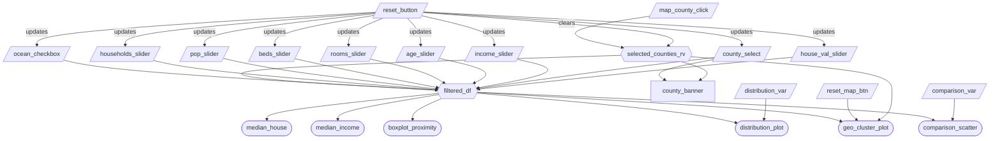
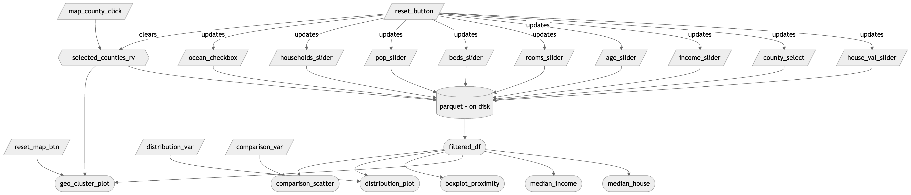
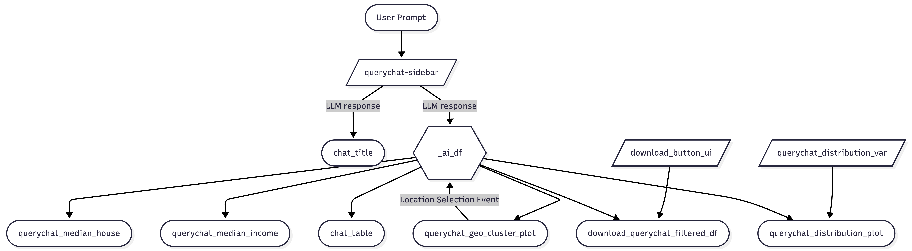

# Milestone 2 App Specification

## Section 1: Job Stories
| #   | Job Story                       | Status         | Notes                         |
| --- | ------------------------------- | -------------- | ----------------------------- |
| 1   | I want to analyze the relationship between median income and median house value so I can determine whether higher income areas were associated with higher property prices in 1990. | ✅ Implemented |  with scatterplot comparing income and house value   |
| 2   | I want to compare median house values across ocean proximity categories in order to assess whether coastal access was associated with higher property values in 1990. | ✅ Implemented     |  with ocean proximity boxplot  |
| 3   | I want to visualize the geographic distribution of house values across California to identify spatial clusters of high and low value regions.| ✅ Implemented  |  with map visualization  |


## Section 2: Component Inventory
### 2.1: Manual Filtering Tab
| ID            | Type          | Shiny widget / renderer   | Depends on                   | Job story  |
| ------------- | ------------- | -----------------------   | ---------------------------- | ---------- |
| `house_val_slider`   | Input         | `ui.input_slider()`          | —                            | #1, #2, #3     |
| `county_select`      | Input         | `ui.input_selectize()`    | —                            | #1, #2, #3     |
| `income_slider`      | Input         | `ui.input_slider()`             | —                            | #1, #2, #3     |
| `age_slider`         | Input         | `ui.input_slider()`                | —                            | #1, #2, #3     |
| `rooms_slider`       | Input         | `ui.input_slider()`              | —                            | #1, #2, #3     |
| `beds_slider`        | Input         | `ui.input_slider()`               | —                            | #1, #2, #3     |
| `pop_slider`         | Input         | `ui.input_slider()`                | —                            | #1, #2, #3     |
| `households_slider`  | Input         | `ui.input_slider()`         | —                            | #1, #2, #3     |
| `ocean_checkbox`       | Input         | `ui.input_checkbox_group()`              | —                            | #1, #2, #3     |
| `comparison_var`       | Input         | `ui.input_select()`              | —                            | #1, #2, #3     |
| `distribution_var`   | Input         | `ui.input_select()`          | —                            | #1, #2         |
| `reset_button`   | Input         | `ui.input_action_button()`          | —                            | #1, #2, #3         |
| `reset_map_btn`      | Input         | `ui.input_action_button()`|  | #3         |
| `map_county_click` | Input       | `Shiny.setInputValue()`  | — | #1, #2, #3 |
| `selected_counties_rv` | Reactive value | `reactive.value` | `map_county_click`, `reset_button` | #1, #2, #3 |
| `filtered_df` | Reactive calc | `@reactive.calc`    | `house_val_slider`,`income_slider`,`age_slider`,`rooms_slider`,`beds_slider`,`pop_slider`,`households_slider`,`ocean_checkbox`, `county_select`, `selected_counties_rv` | #1, #2, #3 |
| `median_house`        | Output        | `ui.value_box`          | `filtered_df`                | #1, #2         |
| `median_income`       | Output        | `ui.value_box`          | `filtered_df`                | #1, #2         |
| `geo_cluster_plot`    | Output        | `@render.ui`          | `filtered_df`, `selected_counties_rv`, `reset_map_btn`  | #3             |
| `distribution_plot`   | Output        | `@render.plot`          | `filtered_df`,`distribution_var`    | #1, #2         |
| `comparison_scatter`  | Output        | `@render.plot`          | `filtered_df`, `comparison_var`        | #1, #2         |
| `boxplot_proximity`   | Output        | `@render.plot`          | `filtered_df`                | #1, #2         |
| `county_banner`   | Output        | `@render.ui`          | `county_select`, `selected_counties_rv`                | #1, #2, #3         |


### 2.2: AI Chatbot Tab
| ID            | Type          | Shiny widget / renderer   | Depends on                   | Job story  |
| ------------- | ------------- | -----------------------   | ---------------------------- | ---------- |
| `querychat-sidebar`              | Input         | `ui.Sidebar()`                      | —            | #1, #2, #3 |
| `querychat_distribution_var`     | Input         | `ui.input_select()`                 | —            | #1, #2 |
| `download_button_ui`             | Input         | `ui.download_button()`              | `_ai_df`       | #1, #2, #3 |
| `_ai_df`                         | Reactive calc | `@reactive.calc`                    | `querychat-sidebar` | #1, #2, #3 |
| `querychat_median_house`         | Output        | `ui.value_box`                      | `_ai_df`       | #1, #2     |
| `querychat_median_income`        | Output        | `ui.value_box`                      | `_ai_df`       | #1, #2     |
| `querychat_geo_cluster_plot`     | Output        | `@render.ui`                        | `_ai_df`       | #3         |
| `querychat_distribution_plot`    | Output        | `@render.plot`                      | `_ai_df`, `querychat_distribution_var` | #1, #2 |
| `chat_title`                     | Output        | `@render.text`                      | `querychat-sidebar` | #1, #2, #3 |
| `chat_table`                     | Output        | `@render.data_frame`                | `_ai_df`       | #1, #2, #3 |
| `download_querychat_filtered_df` | Output        | `@render.download`                  | `_ai_df`, `ui.download_button()`       | #1, #2, #3 |

## Section 3: Reactivity Diagram
### 3.1 Manual Filtering Tab
````markdown

````


### 3.2 AI Chatbot Tab
````markdown

````


## Section 4: Calculation Details

### 4.1 Manual Filtering Tab

**Dataset Filtering:**
The `@reactive.calc` `filtered_df` depends on the inputs:

- `house_val_slider` minimum and maximum - aka Median house value
- `income_slider` minimum and maximum - Median income
- `age_slider` minimum and maximum - House age
- `rooms_slider` minimum and maximum - Total number of rooms
- `beds_slider` minimum and maximum - Total number of bedrooms
- `pop_slider` minimum and maximum - Population
- `households_slider` minimum and maximum - Number of households
- `ocean_checkbox` - selected categorical value(s) for ocean proximity
- `county_select` - selected California counties to include
- `selected_counties_rv` - counties selected via map clicks (merged with `county_select`)

This calculation filters the rows of the raw dataframe to all selected input values.
It is consumed by the map visualization, the two value boxes for median house value and median income value, and the three plots: the distribution plot, the comparison scatter plot, and the ocean proximity box plot.

**County Banner:**

The `county_banner` output displays the currently active county selection below the dashboard subtitle. When no counties are selected it reads "Showing all counties in California". When 1–3 counties are selected it lists them by name. When more than 3 are selected it shows the first 3 and "and N other(s)". It depends on `county_select` and `selected_counties_rv` and updates from both selection sources.

**Map County Click Interaction:**

- Clicking a county polygon on `geo_cluster_plot` fires a JavaScript `Shiny.setInputValue("map_county_click", ...)` event, passing the county name and whether the Shift key was held.
- `selected_counties_rv` (a `reactive.value`) handles the toggle logic: a plain click sets the selection to just that county; a Shift+click adds or removes that county from the current list.
- The `reset_button` also resets `selected_counties_rv` to an empty list and clears the `county_select` dropdown.
- Clicked counties are visually highlighted on the map with a distinct fill colour so users can see what is selected.
- When counties are selected, the map zooms to fit the bounding box of the matching county polygons from the GeoJSON, so the zoom level always shows the full county shape. When no county is selected, the map fits all visible data points with a max zoom of 12.
- The `reset_map_btn` button re-renders `geo_cluster_plot` with the default zoom (centred on California, zoom 6), restoring the original map view without clearing any other filters.
- An ℹ️ info icon is overlaid in the bottom-right corner of the map. Hovering over it displays a tooltip instructing users to click a county to filter, and Shift+click to select multiple counties.

### 4.2 AI Chatbot Tab

- The `querychat-sidebar` processes natural language prompts into subsetted data.
- A reactive calculation converts the `querychat-sidebar` output into a standard Pandas DataFrame `_ai_df`. This step includes a fallback mechanism to return the full dataset if no query has been initiated.
- The DataFrame `_ai_df` is consumed by a table `chat_table`,  the map visualization `querychat_geo_cluster_plot` , the two value boxes for median house value `querychat_median_house` and median income value `querychat_median_income`, and one plot: the distribution plot `querychat_distribution_plot`.
- A download button `download_button_ui` to export and download the filtered DataFrame `_ai_df` to a CSV format file.
- A dropdown menu `querychat_distribution_var` to select which `querychat_distribution_plot` to be showed.
User interactions on the `querychat_geo_cluster_plot` trigger a feedback event that refines the DataFrame `_ai_df` filter, allowing for "drill-down" analysis without manual slider adjustments.

## Section 5: Testing Specification

The testing suite documents expected behavior and makes it clear what breaks if core logic changes. It is not intended for full coverage.

### 5.1 Test Format and Structure

- **Unit tests (pytest)**: Test functions in isolation with explicit inputs and expected outputs.
- **Integration/E2E tests (Playwright)**: Exercise the running app in a browser to verify user-facing behaviors.

### 5.2 Requirements

| Requirement | Description |
| ----------- | ----------- |
| Playwright tests | At least 3 distinct behaviors (e.g., edge-case filter, aggregation correctness, data type or boundary condition). |
| Refactoring | Extract at least 1 pure function from the app and write a pytest unit test for it. |
| Descriptions | Each test must include a one-sentence docstring explaining what behavior is verified and why it matters for the dashboard. |
| Environment | Tests must pass on a clean environment (after `conda env create -f environment.yml`). |
| Execution | A single command runs all tests (e.g., `pytest` or `make test`). |
| Documentation | How to run tests is documented in the README. |

### 5.3 Proposed Test Plan

#### Unit tests (pytest)

| Test | Function / Logic | What it verifies |
| ---- | ---------------- | ---------------- |
| `test_apply_filters_returns_subset` | `apply_filters(df, ...)` (to be extracted) | Given explicit slider/checkbox/county inputs, the filter returns a subset of rows whose columns satisfy the specified ranges; verifies core filtering logic. |
| `test_apply_filters_empty_county_select` | `apply_filters(df, county_select=[])` | When no county is selected, all counties are included; documents the "no selection = show all" behavior. |
| `test_create_median_house_value_box_empty_df` | `create_median_house_value_box` | Empty or invalid DataFrame produces a safe fallback value box (e.g., "N/A"); prevents crashes when filters yield no data. |
| `test_create_median_income_box_aggregation` | `create_median_income_box` | Median of filtered data is computed correctly and compared to state median; verifies aggregation and percentage calculation. |

#### Playwright tests (E2E)

| Test | Behavior | What it verifies |
| ---- | -------- | ---------------- |
| Edge-case filter | Apply filters that result in zero rows (e.g., disjoint slider ranges). | Dashboard shows "No data" or equivalent instead of crashing; value boxes and plots handle empty state. |
| Aggregation correctness | Filter to a known subset (e.g., single county), read displayed median. | Displayed median house value and median income match expected values from the filtered dataset. |
| Data type / boundary | Use sliders at min/max bounds or extreme values. | App handles boundary inputs without errors; displayed data is within expected ranges. |

### 5.4 Implementation Tasks

1. **Refactor**: Extract `apply_filters(df, house_val_range, income_range, ...)` into a pure function in a module (e.g., `src/utils.py` or within `app.py`) that takes a DataFrame and filter parameters and returns the filtered DataFrame.
2. **Unit tests**: Create `tests/test_utils.py` with pytest tests for the refactored function and existing helpers (e.g., `create_median_house_value_box`, `create_median_income_box`).
3. **Playwright setup**: Add `pytest-playwright` (or equivalent) to `environment.yml` / `requirements.txt`; add `tests/test_e2e.py` with at least 3 Playwright tests.
4. **README**: Add a "Testing" section with the single command to run all tests and any setup (e.g., `playwright install` for browsers).
5. **Reflection**: Add a short reflection (`TESTING.md`) describing what each test covers and what would break if the behavior changed.

## Section 6. UI & Plot Details

- 'Reset View' button (`reset_map_btn`) on the map resets the view after zooming without clearing selection.
- Each accordion panel header ("House Properties" and "Socio-economic Properties") contains a info ⓘ icon. Hovering over it displays a tooltip explaining that 'all measures are aggregated at the census block level'.
- Rename 'Manual Filtering' tab to 'Dashboard'.
