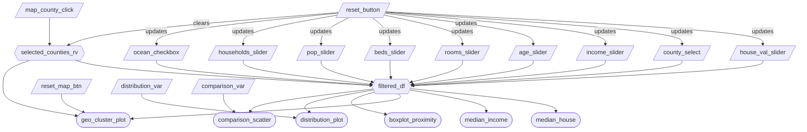
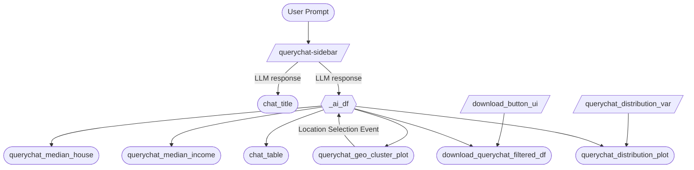

# Milestone 2 App Specification

## Section 1: Job Stories
| #   | Job Story                       | Status         | Notes                         |
| --- | ------------------------------- | -------------- | ----------------------------- |
| 1   | I want to analyze the relationship between median income and median house value so I can determine whether higher income areas were associated with higher property prices in 1990. | ✅ Implemented |  with scatterplot comparing income and house value   |
| 2   | I want to compare median house values across ocean proximity categories in order to assess whether coastal access was associated with higher property values in 1990. | ✅ Implemented     |  with ocean proximity boxplot  |
| 3   | I want to visualize the geographic distribution of house values across California to identify spatial clusters of high and low value regions.| ✅ Implemented  |  with map visualization  |


## Section 2: Component Inventory
### 2.1: Manual Filtering Tab
| ID            | Type          | Shiny widget / renderer   | Depends on                   | Job story  |
| ------------- | ------------- | -----------------------   | ---------------------------- | ---------- |
| `house_val_slider`   | Input         | `ui.input_slider()`          | —                            | #1, #2, #3     |
| `county_select`      | Input         | `ui.input_selectize()`    | —                            | #1, #2, #3     |
| `income_slider`      | Input         | `ui.input_slider()`             | —                            | #1, #2, #3     |
| `age_slider`         | Input         | `ui.input_slider()`                | —                            | #1, #2, #3     |
| `rooms_slider`       | Input         | `ui.input_slider()`              | —                            | #1, #2, #3     |
| `beds_slider`        | Input         | `ui.input_slider()`               | —                            | #1, #2, #3     |
| `pop_slider`         | Input         | `ui.input_slider()`                | —                            | #1, #2, #3     |
| `households_slider`  | Input         | `ui.input_slider()`         | —                            | #1, #2, #3     |
| `ocean_checkbox`       | Input         | `ui.input_checkbox_group()`              | —                            | #1, #2, #3     |
| `comparison_var`       | Input         | `ui.input_select()`              | —                            | #1, #2, #3     |
| `distribution_var`   | Input         | `ui.input_select()`          | —                            | #1, #2         |
| `reset_button`   | Input         | `ui.input_action_button()`          | —                            | #1, #2, #3         |
| `reset_map_btn`      | Input         | `ui.input_action_button()`|  | #3         |
| `map_county_click` | Input       | `Shiny.setInputValue()`  | — | #1, #2, #3 |
| `selected_counties_rv` | Reactive value | `reactive.value` | `map_county_click`, `reset_button` | #1, #2, #3 |
| `filtered_df` | Reactive calc | `@reactive.calc`    | `house_val_slider`,`income_slider`,`age_slider`,`rooms_slider`,`beds_slider`,`pop_slider`,`households_slider`,`ocean_checkbox`, `county_select`, `selected_counties_rv` | #1, #2, #3 |
| `median_house`        | Output        | `ui.value_box`          | `filtered_df`                | #1, #2         |
| `median_income`       | Output        | `ui.value_box`          | `filtered_df`                | #1, #2         |
| `geo_cluster_plot`    | Output        | `@render.ui`          | `filtered_df`, `selected_counties_rv`, `reset_map_btn`  | #3             |
| `distribution_plot`   | Output        | `@render.plot`          | `filtered_df`,`distribution_var`    | #1, #2         |
| `comparison_scatter`  | Output        | `@render.plot`          | `filtered_df`, `comparison_var`        | #1, #2         |
| `boxplot_proximity`   | Output        | `@render.plot`          | `filtered_df`                | #1, #2         |

### 2.2: AI Chatbot Tab
| ID            | Type          | Shiny widget / renderer   | Depends on                   | Job story  |
| ------------- | ------------- | -----------------------   | ---------------------------- | ---------- |
| `querychat-sidebar`              | Input         | `ui.Sidebar()`                      | —            | #1, #2, #3 |
| `querychat_distribution_var`     | Input         | `ui.input_select()`                 | —            | #1, #2 |
| `download_button_ui`             | Input         | `ui.download_button()`              | `_ai_df`       | #1, #2, #3 |
| `_ai_df`                         | Reactive calc | `@reactive.calc`                    | `querychat-sidebar` | #1, #2, #3 |
| `querychat_median_house`         | Output        | `ui.value_box`                      | `_ai_df`       | #1, #2     |
| `querychat_median_income`        | Output        | `ui.value_box`                      | `_ai_df`       | #1, #2     |
| `querychat_geo_cluster_plot`     | Output        | `@render.ui`                        | `_ai_df`       | #3         |
| `querychat_distribution_plot`    | Output        | `@render.plot`                      | `_ai_df`, `querychat_distribution_var` | #1, #2 |
| `chat_title`                     | Output        | `@render.text`                      | `querychat-sidebar` | #1, #2, #3 |
| `chat_table`                     | Output        | `@render.data_frame`                | `_ai_df`       | #1, #2, #3 |
| `download_querychat_filtered_df` | Output        | `@render.download`                  | `_ai_df`, `ui.download_button()`       | #1, #2, #3 |

## Section 3: Reactivity Diagram
### 3.1 Manual Filtering Tab
````markdown

````


### 3.2 AI Chatbot Tab
````markdown

````


## Section 4: Calculation Details

### 4.1 Manual Filtering Tab

**Dataset Filtering:**
The `@reactive.calc` `filtered_df` depends on the inputs:

- `house_val_slider` minimum and maximum - aka Median house value
- `income_slider` minimum and maximum - Median income
- `age_slider` minimum and maximum - House age
- `rooms_slider` minimum and maximum - Total number of rooms
- `beds_slider` minimum and maximum - Total number of bedrooms
- `pop_slider` minimum and maximum - Population
- `households_slider` minimum and maximum - Number of households
- `ocean_checkbox` - selected categorical value(s) for ocean proximity
- `county_select` - selected California counties to include
- `selected_counties_rv` - counties selected via map clicks (merged with `county_select`)

This calculation filters the rows of the raw dataframe to all selected input values.
It is consumed by the map visualization, the two value boxes for median house value and median income value, and the three plots: the distribution plot, the comparison scatter plot, and the ocean proximity box plot.

**Map County Click Interaction:**

- Clicking a county polygon on `geo_cluster_plot` fires a JavaScript `Shiny.setInputValue("map_county_click", ...)` event, passing the county name and whether the Shift key was held.
- `selected_counties_rv` (a `reactive.value`) handles the toggle logic: a plain click sets the selection to just that county; a Shift+click adds or removes that county from the current list.
- The `reset_button` also resets `selected_counties_rv` to an empty list and clears the `county_select` dropdown.
- Clicked counties are visually highlighted on the map with a distinct fill colour so users can see what is selected.
- When counties are selected, the map zooms to fit the bounding box of the matching county polygons from the GeoJSON, so the zoom level always shows the full county shape. When no county is selected, the map fits all visible data points with a max zoom of 12.
- The `reset_map_btn` button re-renders `geo_cluster_plot` with the default zoom (centred on California, zoom 6), restoring the original map view without clearing any other filters.
- An ℹ️ info icon is overlaid in the bottom-right corner of the map. Hovering over it displays a tooltip instructing users to click a county to filter, and Shift+click to select multiple counties.

### 4.2 AI Chatbot Tab

- The `querychat-sidebar` processes natural language prompts into subsetted data.
- A reactive calculation converts the `querychat-sidebar` output into a standard Pandas DataFrame `_ai_df`. This step includes a fallback mechanism to return the full dataset if no query has been initiated.
- The DataFrame `_ai_df` is consumed by a table `chat_table`,  the map visualization `querychat_geo_cluster_plot` , the two value boxes for median house value `querychat_median_house` and median income value `querychat_median_income`, and one plot: the distribution plot `querychat_distribution_plot`.
- A download button `download_button_ui` to export and download the filtered DataFrame `_ai_df` to a CSV format file.
- A dropdown menu `querychat_distribution_var` to select which `querychat_distribution_plot` to be showed.
User interactions on the `querychat_geo_cluster_plot` trigger a feedback event that refines the DataFrame `_ai_df` filter, allowing for "drill-down" analysis without manual slider adjustments.


## Section 6. Plot Details

- 'Reset View' button (`reset_map_btn`) on the map resets the view after zooming without clearing selection.